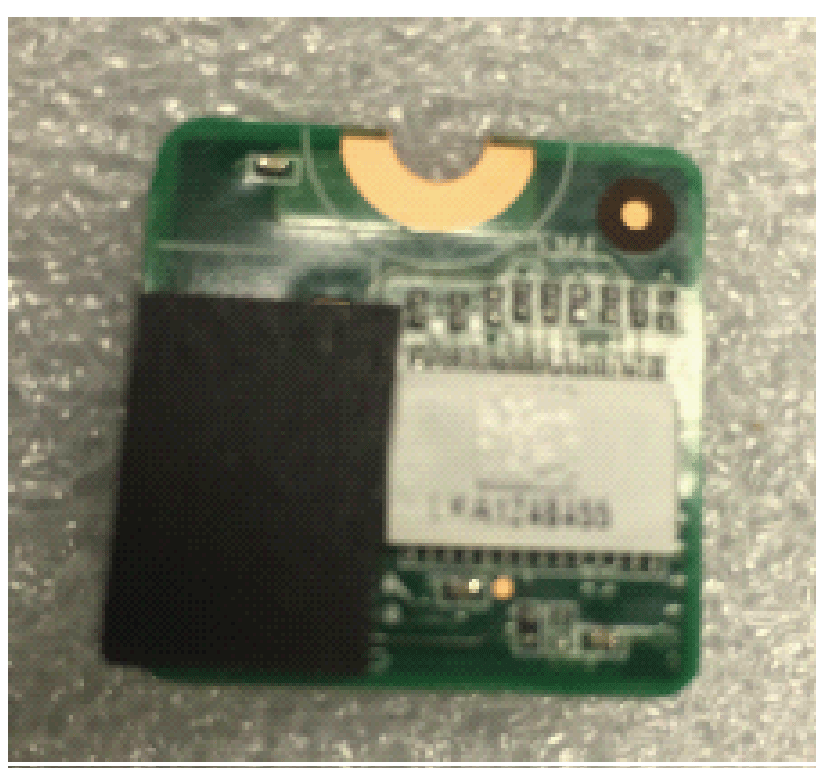
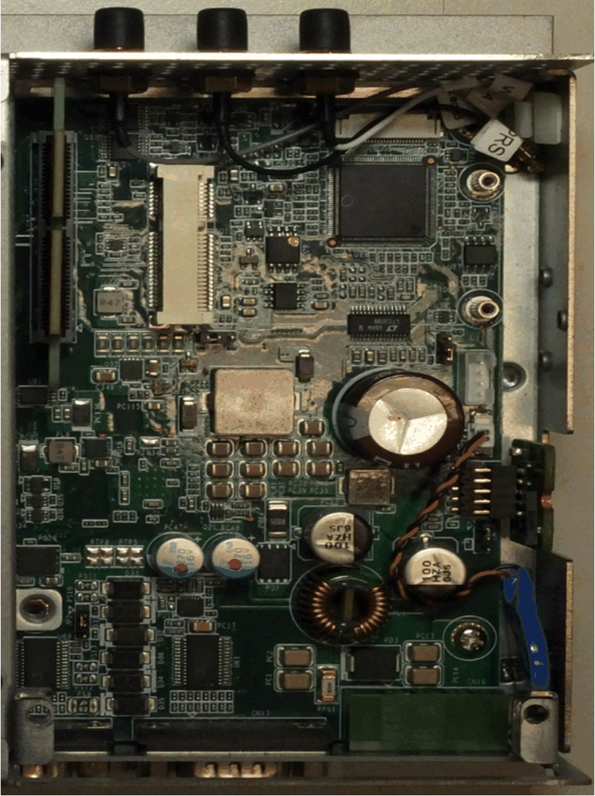
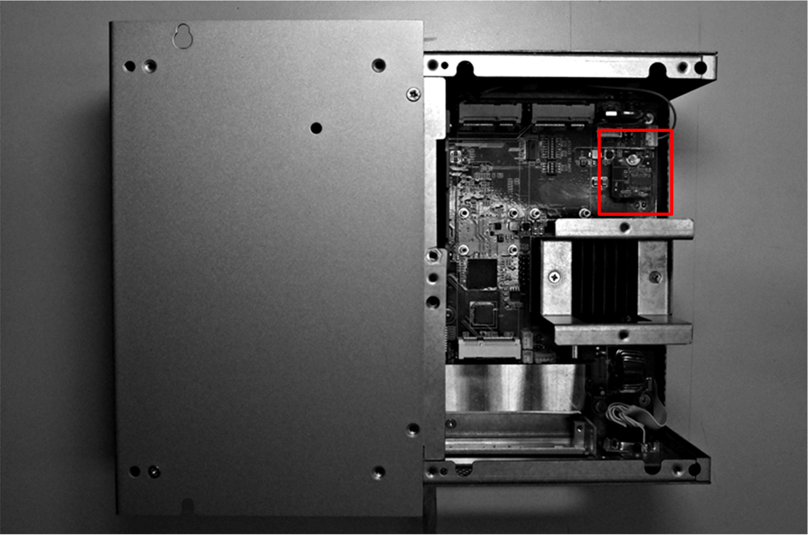

# Cyber Security TPM Module Description

Cyber Security TPM Module Description

Introduction

The HMIYMINATPM201 is categorized as industrial module. It is compatible with the low pin count module. The Trusted Platform Module (TPM) is an international standard for a secure cryptopro­cessor, which is a dedicated microcontroller designed to secure hardware by integrating cryptographic keys into devices.

The mother boards and the BIOS of Magelis Box iPC allows you to install the TPM module and activate encryption with the Windows BitLocker. Then, storage drives and operating system are encrypted according to password and keys managed within the hardware module.

According to part number, the HMIYMINATPM201 TPM module can default mounted following the CTO (configured to order) or can be user mounted afterward as an optional accessory module. The encryption can be activated with Windows BitLocker.

Plug the module onto the Box iPC pin header.

Module Compatibility Table

| Part number | Description | HMIBMU/HMIBMP | HMIBMI/HMIBMO |
| --- | --- | --- | --- |
| HMIYMINATPM201 | TPM 2.0 module | Yes(1) | Yes |
| NOTE: (1) Need to downgrade to TPM 1.2 module. | | | |

Module View

Box iPC Optimized:

Box iPC Universal/Box iPC Performance:

Module Installation

Before installing or removing a mini PCIe card, shut down Windows operating system in an orderly fashion and remove the power from the device.

|  |
| --- |
| NOTICE |
| ELECTROSTATIC DISCHARGE |
| Take the necessary protective measures against electrostatic discharge before attempting to remove the Magelis Industrial PC cover. |
| Failure to follow these instructions can result in equipment damage. |

|  |
| --- |
| Caution_Color.gifCAUTION |
| OVERTORQUE AND LOOSE HARDWARE |
| oDo not exert more than 0.5 Nm (4.5 lb-in) of torque when tightening the installation fastener, enclosure, accessory, or terminal block screws. Tightening the screws with excessive force can damage the installation fastener.  oWhen fastening or removing screws, ensure that they do not fall inside the Magelis Industrial PC chassis. |
| Failure to follow these instructions can result in injury or equipment damage. |

NOTE: Remove the power before attempting this procedure.

| Step | Action |
| --- | --- |
| 1 | Install TPM card:  G-SE-0062765.2.gif-high.gif |

| Step | Action |
| --- | --- |
| 1 | Release the screw:  G-SE-0062763.1.gif-high.gif |
| 2 | Install the TPM card:  G-SE-0062766.1.gif-high.gif      Lock the screw:  G-SE-0062777.1.gif-high.gif |

TPM Module Compatibility Table

|  | TPM 1.2 | TPM 2.0 |
| --- | --- | --- |
| BIOS support | Legacy or UEFI | UEFI |
| BitLocker support | Yes | Yes |

NOTE: TPM module is TPM 2.0 FW as default. It needs to downgrade to TPM 1.2 FW for HMIBMU/HMIBMP.

| Model | Default BIOS | TPM 1.2 | TPM 2.0 |
| --- | --- | --- | --- |
| HMIBMU/HMIBMP | Legacy | Support (need to downgrade TPM to 1.2) | Not support |
| HMIBMI/HMIBMO | UEFI | Support | Support |

BitLocker Function

The BitLocker is a full disk encryption feature in Windows. It is designed to protect data by providing encryption for entire volumes. All the OS defaults have this function but for WES7, if System Reserved partition is combined with partition C:\, the BitLocker cannot be used to protect fixed drive.

TPM Owner Password Setting

NOTE:  A keyboard is required to enter the BitLocker PIN during Box startup. The touch screen function is disabled during this step.

| Step | Action |
| --- | --- |
| 1 | Open Control Panel → BitLocker Drive Encryption.  G-SE-0058529.1.gif-high.gif |
| 2 | Click TPM Administration to Change Owner Password.  G-SE-0058530.1.gif-high.gif |
| 3 | Select Change Owner Password.  G-SE-0058531.1.gif-high.gif |
| 4 | Choose either Automatically create the password or Manually create the password.  G-SE-0058532.1.gif-high.gif      G-SE-0058533.1.gif-high.gif      G-SE-0058534.1.gif-high.gif |

NOTE: If you enter the wrong password more than 30 times, the TPM gets locked.

About the TPM Owner Password

Starting with Windows 10, version 1607, Windows do not retain the TPM owner password when provisioning the TPM. The password is set to a random high entropy value and then discarded.

Microsoft related link:<https://docs.microsoft.com/en-us/windows/security/hardware-protection/tpm/change-the-tpm-owner-password>

|  |
| --- |
| Caution_Color.gifCAUTION |
| UNINTENED EQUIPEMENT OPERATION |
| Follow Microsoft suggestion. We strongly recommend that you do not do this change. If you change the register value, then set the password manually. There are side effects happened and no guarantee and support from Microsoft and Schneider side. You need to take the responsibility for the result of this change. |
| Failure to follow these instructions can result in injury or equipment damage. |

Turn On BitLocker Setting

NOTE:  A keyboard is required to enter the BitLocker PIN during Box startup. The touch screen function is disabled during this step.

| Step | Action |
| --- | --- |
| 1 | Open Control Panel → BitLocker Drive Encryption.  G-SE-0058529.1.gif-high.gif |
| 2 | Click Turn on BitLocker.  G-SE-0058535.1.gif-high.gif |
| 3 | Choose either Enter a PIN or Insert a USB flash drive or Let BitLocker automatically unlock my drive.  G-SE-0058536.1.gif-high.gif      NOTE: The keyboard is required to enter BitLocker PIN during Box startup. The tactile function is disabled during this step. |
| 4 | Enter a PIN.  G-SE-0058537.1.gif-high.gif |
| 5 | Select any one of Save to your Microsoft account or Save to a file or Print the recovery key.  G-SE-0058538.1.gif-high.gif |
| 6 | Select either Encrypt used disk space only or Encrypt entire drive.  G-SE-0058539.1.gif-high.gif |
| 7 | Click the check box of Run BitLocker system check and select Continue.  G-SE-0058540.1.gif-high.gif |
| 8 | The figure shows the process of the Encryption.  G-SE-0058541.1.gif-high.gif      Encryption is completed.  G-SE-0058542.1.gif-high.gif |

Turn Off BitLocker Setting

| Step | Action |
| --- | --- |
| 1 | Open Control Panel → BitLocker Drive Encryption.  G-SE-0058529.1.gif-high.gif |
| 2 | Click Turn off BitLocker.  G-SE-0058543.1.gif-high.gif |

TPM Module Downgrade

The TPM module is TPM 2.0 firmware as default. It needs to downgrade to TPM 1.2 firmware for HMIPCCU2B/HMIPCCP2B series.

| Step | Action |
| --- | --- |
| 1 | Disable TPM in BIOS:  1.Go to Advanced > Trusted Computing.  2.Disable Security Device Support.  G-SE-0063412.1.gif-high.gif  G-SE-0063411.1.gif-high.gif |
| 2 | Start the recovery USB memory key:  1.Boot up from the recovery USB memory key.  2.Click Cancel to leave the recovery process.  G-SE-0065599.1.gif-high.gif  Start the TPM downgrade tool.  Type Alt + T to start the TPM downgrade tool:  G-SE-0065600.1.gif-high.gif |
| 3 | Click Yes to start the downgrade process  G-SE-0063410.1.gif-high.gif |
| 4 | Downgrade process starts.  After the process is finished, press Enter to continue:  G-SE-0063409.2.gif-high.gif |
| 5 | Click OK to reboot:  G-SE-0063408.2.gif-high.gif |
| 6 | Enable TPM in BIOS:  1.Go to Advanced > Trusted Computing.  2.Enable Security Device Support.  G-SE-0063407.1.gif-high.gif |
| 7 | Check the TPM version in Windows:  oGo to Control Panel > BitLocker Drive Encryption > TPM Administrator.  oCheck the TPM version is 1.2.  G-SE-0063406.1.gif-high.gif |

Instruction on How to Update the TPM 1.2 Firmware for Windows 7

| Step | Action |
| --- | --- |
| 1 | Select the check box to accept the license agreement.  G-SE-0071233.1.gif-high.gif |
| 2 | Install TPM recovery driver if necessary.  NOTE: Installation may require a restart of your computer. |
| 3 | Check platform details.  G-SE-0071232.1.gif-high.gif |
| 4 | Enter the Owner Password or the Owner Password Backup File if the Owner Password is not managed by the operating system.  Do the following steps:  oSelect I have the Owner Password Backup File.  G-SE-0071231.1.gif-high.gif  oSelect \*.tpm file.  G-SE-0071230.1.gif-high.gif  oSelect Next.  G-SE-0071229.1.gif-high.gif |
| 5 | Perform the update as shown below:  G-SE-0071228.1.gif-high.gif      G-SE-0071227.1.gif-high.gif |
| 6 | Restart your computer.  NOTE: Save all unsaved work in all user sessions before restarting in order to ensure prevention of data loss. |

Clearing and reinitializing the TPM after the update is recommended for the update paths included in this version of Infineon TPM firmware Update. For more information, see Microsoft Security Advisory ADV170012 or visit <www.infineon.com/tpm-update>.

|  |
| --- |
| Warning_Color.gifWARNING |
| HIGH RISK TO LOSE DATA |
| Clearing the TPM resets it to factory defaults. You lose all created keys and data protected by those keys. |
| Failure to follow these instructions can result in death, serious injury, or equipment damage. |

Instruction on How to Update the TPM 1.2 Firmware for Windows 8.1

| Step | Action |
| --- | --- |
| 1 | Select the check box to accept the license agreement.  G-SE-0071226.1.gif-high.gif |
| 2 | Install TPM recovery driver if necessary.  NOTE: Installation may require a restart of your computer. |
| 3 | Check platform details  G-SE-0071225.1.gif-high.gif |
| 4 | Perform the update as shown below:  G-SE-0071224.1.gif-high.gif      G-SE-0071223.1.gif-high.gif |
| 5 | Restart your computer.  NOTE: Save all unsaved work in all user sessions before restarting in order to ensure prevention of data loss. |

Clearing and reinitializing the TPM after the update is recommended for the update paths included in this version of Infineon TPM firmware Update. For more information, see Microsoft Security Advisory ADV170012 or visit <www.infineon.com/tpm-update>.

|  |
| --- |
| Warning_Color.gifWARNING |
| HIGH RISK TO LOSE DATA |
| Clearing the TPM resets it to factory defaults. You lose all created keys and data protected by those keys. |
| Failure to follow these instructions can result in death, serious injury, or equipment damage. |

TPM 1.2 Firmware Update for Windows 10

If ownership of the TPM was taken with Windows 10® Version 1607 or later then by default the owner authorization is no longer stored on the local system. Refer to the [Microsoft article](https://docs.microsoft.com/en-us/windows/device-security/tpm/change-the-tpm-owner-password) for more information. To update the firmware, you need to clear the TPM and take ownership again with modified Windows setting. So, that the owner authorization is stored on the local system.

|  |
| --- |
| Warning_Color.gifWARNING |
| HIGH RISK TO LOSE DATA |
| Clearing the TPM resets it to factory defaults. You lose all created keys and data protected by those keys. |
| Failure to follow these instructions can result in death, serious injury, or equipment damage. |

| Step | Action |
| --- | --- |
| 1 | Set registry key HKLM\Software\Policies\Microsoft\TPM [REG\_DWORD] OSManagedAuthLevel to 4.  oSelect Run then type the text regedit as shown below:  G-SE-0071222.1.gif-high.gif  Click OK  oChange the Value date to 4 for OSManagedAuthLevel .  G-SE-0071221.1.gif-high.gif  Click OK |
| 2 | Start tpm.msc and click Clear TPM....  G-SE-0071220.1.gif-high.gif |
| 3 | Restart the computer.  NOTE: Save all unsaved work in all user sessions before restart the computer in order to ensure prevention of data loss. |
| 4 | Start tpm.msc and click Prepare the TPM....  G-SE-0071219.1.gif-high.gif |
| 5 | Wait for Windows to reprepare the TPM (Windows stores owner authorization on local system). When the preparation is completed, status field in tpm.msc displays The TPM is ready.  G-SE-0071218.1.gif-high.gif |
| 6 | Run the TPM firmware update tool to update the firmware of the TPM as shown below:  G-SE-0071217.1.gif-high.gif      G-SE-0071216.1.gif-high.gif      G-SE-0071215.1.gif-high.gif |
| 7 | Restart the computer.  NOTE: Save all unsaved work in all user sessions before restart the computer in order to ensure prevention of data loss. |
| 8 | Restore registry key HKLM\Software\Policies\Microsoft\TPM [REG\_DWORD] OSManagedAuthLevel to its previous Value data 2.  G-SE-0071214.1.gif-high.gif      Click OK |
| 9 | Start tpm.msc and click on Clear TPM....  G-SE-0071213.1.gif-high.gif |
| 10 | Restart the computer.  NOTE: Save all unsaved work in all user sessions before restart the computer in order to ensure prevention of data loss. |
| 11 | Start tpm.msc and click Prepare the TPM....  G-SE-0071212.1.gif-high.gif |
| 12 | Wait for Windows to reprepare the TPM (using Windows 10 security measures). When the preparation is completed, in status field tpm.msc displays The TPM is ready for use.  G-SE-0071211.1.gif-high.gif      Check the Manufacturer Version is 4.43. |

EIO0000002042.06

© 2019 Schneider Electric. All rights reserved.