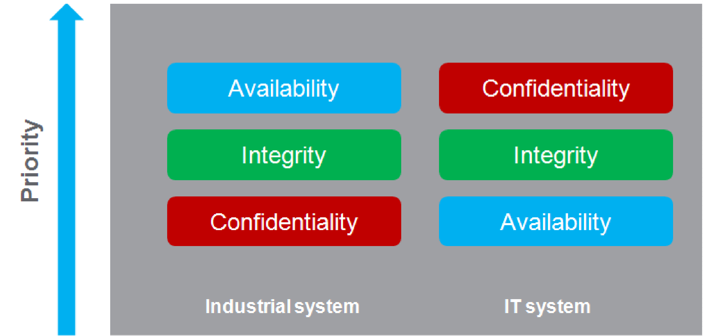

# Cyber Security

Cyber Security

Overview

It is a fact that Industrial and control systems are more and more vulnerable to cyber attacks due to their modern design:

oThey use commercial technologies.

oThey are more and more connected.

oThey can be remotely accessible.

oTheir strategic location in the industrial processes is a point of interest for hackers.

Industrial systems have also different cyber security objectives compared to typical IT systems.To secure properly the industrial installation, it is important to understand these differences. Three fundamental characteristics have to be considered:

oAvailability of the system: how to ensure that the system remains operational?

oIntegrity of the data: how to maintain the integrity of information?

oConfidentiality: how to avoid information disclosure?

The priorities between an industrial system and a typical IT system are not the same as described on the following diagrams:

A good recommendation to address these security objectives is to adopt a defense-in-depth approach matching these priorities.

The Box PC IIoT provides a defense-in-depth approach by default, thanks to the different security mechanisms it contains.

The Magelis Box iPC enhanced cyber security to access, communicate, and store information:

To keep the system as secured as possible, it is necessary to secure the environment where the Box is installed by following the standard recommendations described below.

Cybersecurity Support Portal: <http://www.schneider-electric.com/b2b/en/support/cybersecurity/overview.jsp>

General Practices

Unauthorized persons may gain access to the Magelis Industrial PC and Box PC IIoT as well as to other devices on the network/fieldbus of the machine and connected networks via insufficiently secure access to software and networks.

To avoid unauthorized access to the Magelis Industrial PC and Box PC IIoT, users are advised to:

oPerform a hazard and risk analysis that considers all hazards resulting from access to (and operation on) the network/fieldbus, and develop a cyber security plan so.

oVerify that the hardware and software infrastructure that the Magelis Industrial PC and Box PC IIoT is integrated into (along with all organizational measures and rules covering access to the infrastructure) consider the results of the hazard and risk analysis, and are implemented according to best practices and standards such as ISA/IEC 62443.

oVerify the effectiveness of the IT security and cyber security systems using appropriate, proven methods.

oKeep your system up to date (security patches).

oKeep your antivirus up to date.

oDefine properly the security of the Box: access rights, user's accounts. Ensure that the minimum access rights are given to users to avoid illegal access or too much privilege given to the user.

oLimit the access to the only needed information and users.

oEnable data encryption (available by default or as option depending on part numbers).

oGet optional McAfee protection and enable it.

oFollow the recommendations to secure the Network infrastructure (see General Practices chapter in the document How Can I Reduce Vulnerability to Cyber Attacks in PlantStruxure Architectures? ([http://www.schneider-electric.com/b2b/en/support/cybersecurity/resources.jsp?](http://www.schneider-electric.com/b2b/en/support/cybersecurity/resources.jsp?)))

Cyber Security Features Available

Cyber security features available on Magelis Industrial PC and Box PC IIoT:

1.Box PC IIoT architecture is based on the operating system.

2.Hardware can include a [TPM module used for security enforcement](../Simple_panel_PC_-_Hardware_Modifications/Simple_panel_PC_-_Hardware_Modifications-27.htm#XREF_D_SE_0067233_1).

3.BitLocker in collaboration with the TPM module is used to secure the hard disk and provide a [full encryption of the disk](../Simple_panel_PC_-_Hardware_Modifications/Simple_panel_PC_-_Hardware_Modifications-27.htm#XREF_D_SE_0067233_16).

4.Integrity of the operating system is also checked by UEFI (Extensible firmware Interface) mechanism that ensures that the [OS is the official one](../iPC_-_Configuration_of_the_BIOS/iPC_-_Configuration_of_the_BIOS-13.htm#XREF_D_SE_0068018_1).

NOTE: Taking into account the large number of various configurations and applications, convenient and efficient out of the box settings for the Box PC IIoT cannot be provided. It belongs to authorized person in charge of commissioning and configuration to enable or disable functions and interfaces according to cyber security requirements for the applications.

Recommendations For Node-RED

Node-RED can be configured from several channels:

1.Using a connection to Box PC IIoT Node-RED server from another computer in the network.

2.By importing a JSON file in the Box PC IIoT using a media or network access.

3.Using Web services from the Node-RED server from an application.

NOTE: What ever the scenario, the user must be sure that the computer used to access the Box PC IIoT is safe: OS up to date, security patches up to date, antivirus up to date, no malware on the PC.

When importing a JSON file using removable media like USB key must be done carefully to avoid importation of corrupted JSON files or malware on the Box PC IIoT. The operation should be reserved to people authorized to modify the configuration of the Box PC IIoT.

NOTE: A configuration of the Box PC IIoT has a deep impact on the overall security architecture. All modification done in the box configuration can lead to device access or cloud access by unauthorized users.

The configuration of the Box PC IIoT is done thanks to Node-RED configuration with the Node-RED server. The system is provided with an existing set of nodes.

However, for specific needs (specific device access, specific cloud access, specific data management) the user may need new functionalities. This is given by the ability to create new nodes.

NOTE: Creation of new nodes also implies the increase of the attack surface that could lead to an unsecure system.

A Node-RED designer should be aware of the following recommendations to keep the security of the system at the expected level:

oRecommendation 1: Node-RED designers should apply well-known good practices of software engineering to ensure a good quality level and avoid typical mistakes like buffer overflow, bad exception management.

oRecommendation 2: All data coming/going from the devices and more generally all data injected in Node-RED modules should be checked and validated to avoid typical errors like buffer overflow, data injection (see OWASP recommendations for typical errors). Communication errors with devices should also be handled properly to avoid deny of services of the system.

oRecommendation 3: All data coming/going from IT services (like cloud for instance) should be properly checked and validated to avoid information disclosure, deny of services and typical security issues.

EIO0000002042.06

© 2019 Schneider Electric. All rights reserved.