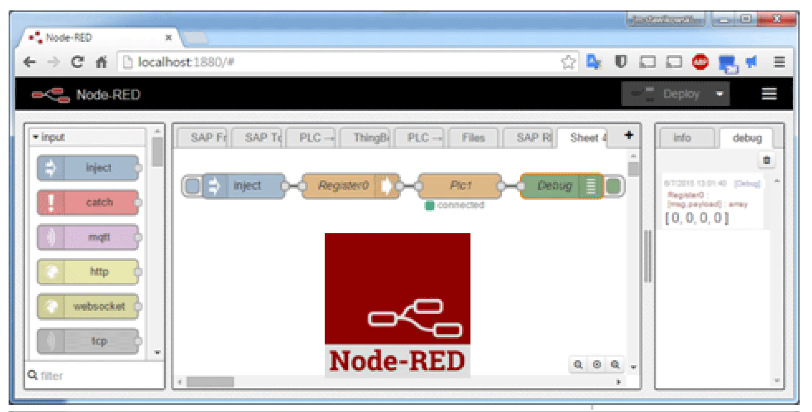

# IIoT and Node-RED

IIoT and Node-RED

Overview

The Industrial Internet of Things (IIoT) is the use of Internet of Things (IoT) technologies in manufacturing. The IoT is a network of intelligent computers, devices, and objects that collect and share huge amounts of data. The collected data is sent to Cloud-based service where it is shared with users in a helpful way.

The IIoT works not only at the machine or process level, but from the device itself, to be seamlessly wired to the business systems and Internet data levels. It is a parallel application model, connecting edge to cloud computing: Collecting data from agent.enabled edge devices, connected to field devices, and improving operations and asset performance with cloud applications.

The IIoT runs analytics in the agents, preferably the field device itself, or an edge device connected to the field devices, interfacing with the automation application. The analytics are built and deployed over time without the need to change or even shut down the existing control system.

The IIoT consolidates analytics across a fleet of heterogeneous assets, in disparate geographies. It aggregates data and seamlessly provides analytics at the cloud level, building the digitalized smart factories and improving responsiveness.

Node-RED

Node-RED leverages IT/OT convergence. It is the new software technology to wire the things from the field to the Internet IT and cloud applications without the need to modify existing systems. It is the quick path to the IIoT. Node-RED is light, open source, and simple to use. An existing transparent Ethernet TCP/IP network is used with Node-RED.

Node-RED is composed of an editor tool and an engine to make easily and run the connections between the IIoT applications. Any things can be connected with Node-RED over the IIoT, including all automation devices with processing capabilities and Ethernet TCP/ IP connections. Even the smallest field devices without such capabilities can be wired with Node-RED thanks to intermediary edge devices that collect data.

Node-RED is the visual tool for wiring the Internet of Things. The Box iPC Nodes are delivered with IIoT package. Any nodes from the Node-RED community can also be used, to “wire” together hardware devices, APIs, and online services in new ways, leveraging Internet of Things and Enterprise 4.0 approaches. It builds the infrastructure for new digitalized services.

Node-RED editor is accessible with Web browser:

The Box iPC can be upgraded with an IIoT featuring Node-RED. Nodes to monitor and control devices are delivered with the package (iPC internal temperatures, storage disk status, power supply status, SMS/email alerts, device recovery, and so on). Open, any of the thousands of nodes available from the Node-RED community can also be added to [wire] together hardware devices, APIs, and online services.

Cybersecurity for the IIoT

Cybersecurity has become a challenge to implementing the IIoT. Using standard network means benefitting from all the security measures already provided by your IT system, such as firewalls, VPNs, and safe zones.

NOTE: The devices with Node-RED can be set to make only [output] communication. The cloud applications have no [input] communication request to the Node-RED devices. Node-RED devices push data to the cloud. So communications to the machine and plant levels are not necessary and should be avoided to guard against attacks.

NOTE: Schneider Electric adheres to industry best practices in the development and implemen­tation of control systems. This includes a "Defense-in-Depth" approach to secure an Industrial Control System. This approach places the controllers behind one or more firewalls to restrict access to authorized personnel and protocols only.

|  |
| --- |
| Warning_Color.gifWARNING |
| UNAUTHENTICATED ACCESS AND SUBSEQUENT UNAUTHORIZED MACHINE OPERATION |
| oEvaluate whether your environment or your machines are connected to your critical infrastructure and, if so, take appropriate steps in terms of prevention, based on Defense-in-Depth, before connecting the automation system to any network.  oLimit the number of devices connected to a network to the minimum necessary.  oIsolate your industrial network from other networks inside your company.  oProtect any network against unintended access by using firewalls, VPN, or other, proven security measures.  oMonitor activities within your systems.  oPrevent subject devices from direct access or direct link by unauthorized parties or unauthen­ticated actions.  oPrepare a recovery plan including backup of your system and process information. |
| Failure to follow these instructions can result in death, serious injury, or equipment damage. |

Platform as a Service at Server Level

A PaaS is an additional basic and efficient way to protect the plant field level because no data from the field is published directly to external applications. The IIoT server at the fog/intranet level gets a copy of the Box iPC data from the IIoT running in the field. It is no longer necessary to have direct communication from the field to the cloud. The field data is cloned or, even better, aggregated, and benefits from analytics at the IIoT server level in a safe zone of the network before being published to the cloud applications.

EIO0000002042.06

© 2019 Schneider Electric. All rights reserved.